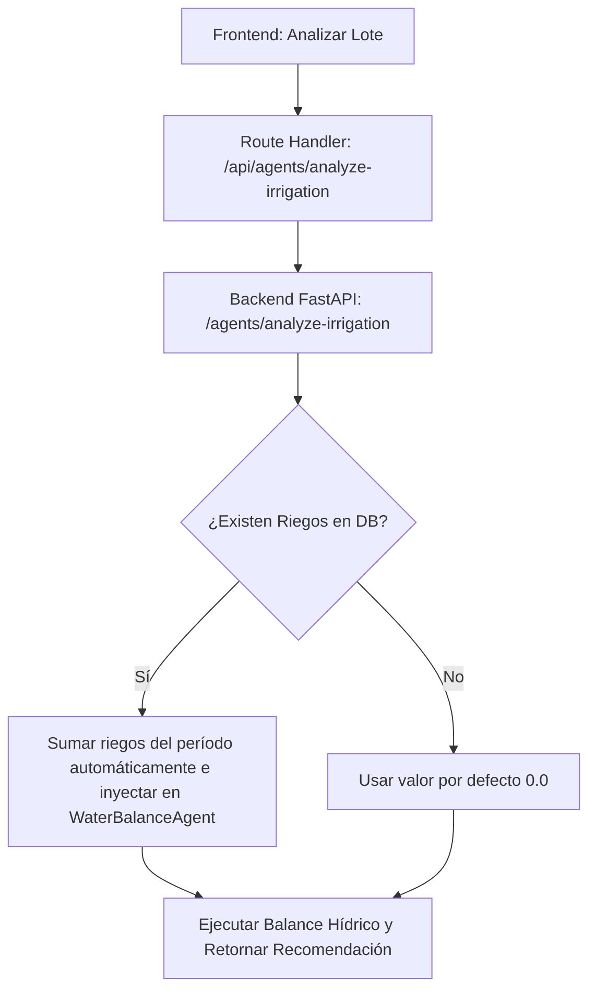

# Requerimientos de Backend para Historial y Reportes de Riego

Este documento detalla las especificaciones técnicas, endpoints API y modelos de base de datos necesarios en el backend FastAPI para soportar completamente la pantalla de **Historial y Reportes** del frontend (incluyendo el caso de uso **CU-05: Registrar Riego** y la visualización de series temporales de balance hídrico).

---

## 1. Persistencia de Eventos de Riego (CU-05)

Actualmente, el registro de riego en el frontend es puramente temporal y local. Se requiere un CRUD completo para persistir y auditar las aplicaciones de agua.

### Modelo de Datos Sugerido (`IrrigationEvent`)

```sql
CREATE TABLE irrigation_events (
    id SERIAL PRIMARY KEY,
    field_id INTEGER REFERENCES fields(id) ON DELETE CASCADE,
    applied_at TIMESTAMP WITH TIME ZONE NOT NULL, -- Fecha y hora del riego
    amount_mm NUMERIC(5, 2) NOT NULL,            -- Lámina de agua aplicada en mm
    method VARCHAR(50) NOT NULL,                 -- Pivote, Goteo, Aspersión, etc.
    notes TEXT,                                  -- Observaciones del operador
    registered_by INTEGER REFERENCES users(id),  -- Usuario que registró el evento
    created_at TIMESTAMP WITH TIME ZONE DEFAULT CURRENT_TIMESTAMP
);
```

### Endpoints Requeridos

#### A. Crear Evento de Riego
* **Endpoint:** `POST /api/v1/fields/{field_id}/irrigation-events`
* **Headers:** `Authorization: Bearer <token>`
* **Request Body:**
```json
{
  "applied_at": "2026-08-15T06:00:00Z",
  "amount_mm": 18.0,
  "method": "Pivote Central",
  "notes": "Riego nocturno optimizado según ventana sugerida por MAS."
}
```
* **Response (201 Created):**
```json
{
  "id": 12,
  "field_id": 3,
  "applied_at": "2026-08-15T06:00:00Z",
  "amount_mm": 18.0,
  "method": "Pivote Central",
  "notes": "Riego nocturno optimizado según ventana sugerida por MAS.",
  "registered_by": 2,
  "created_at": "2026-08-15T17:58:00Z"
}
```

#### B. Listar Eventos de Riego (Filtros por Fecha)
* **Endpoint:** `GET /api/v1/fields/{field_id}/irrigation-events`
* **Headers:** `Authorization: Bearer <token>`
* **Query Params:**
  * `date_from` (opcional, ej. `2026-08-01`)
  * `date_to` (opcional, ej. `2026-08-15`)
* **Response (200 OK):**
```json
[
  {
    "id": 12,
    "applied_at": "2026-08-15T06:00:00Z",
    "amount_mm": 18.0,
    "method": "Pivote Central",
    "notes": "..."
  }
]
```

#### C. Eliminar/Editar Evento (Corrección de errores de carga)
* **Endpoints:** 
  * `PATCH /api/v1/fields/{field_id}/irrigation-events/{event_id}`
  * `DELETE /api/v1/fields/{field_id}/irrigation-events/{event_id}`

---

## 2. Historial Hídrico Diario (Para Gráfico de Evolución)

Para graficar la curva del balance FAO-56 ($D_r$, $AU$, $AFD$, $TAW$), lluvias y riegos del lote a lo largo del tiempo, se necesita un endpoint rápido que retorne una serie temporal diaria. 

> [!TIP]
> **Estrategia de Optimización**: Ejecutar los agentes satelitales y de balance hídrico en tiempo real para 30 días en cada petición web es extremadamente lento e ineficiente. Se recomienda tener un proceso cron (ej. nocturno) que calcule el balance hídrico diario y lo persista en una tabla de caché histórica, o calcularlo bajo demanda solo para fechas no registradas.

### Modelo de Datos Sugerido (`FieldHydricHistory`)

```sql
CREATE TABLE field_hydric_history (
    id SERIAL PRIMARY KEY,
    field_id INTEGER REFERENCES fields(id) ON DELETE CASCADE,
    date DATE NOT NULL,
    deficit_dr_mm NUMERIC(5, 2) NOT NULL,
    available_water_au_mm NUMERIC(5, 2) NOT NULL,
    easily_available_afd_mm NUMERIC(5, 2) NOT NULL,
    total_available_taw_mm NUMERIC(5, 2) NOT NULL,
    etc_mm NUMERIC(4, 2) NOT NULL,
    et0_mm NUMERIC(4, 2) NOT NULL,
    precipitation_mm NUMERIC(4, 2) DEFAULT 0.0,
    irrigation_applied_mm NUMERIC(4, 2) DEFAULT 0.0,
    ndvi_mean NUMERIC(3, 2),
    kc_used NUMERIC(3, 2),
    UNIQUE (field_id, date)
);
```

### Endpoint de Serie Temporal

* **Endpoint:** `GET /api/v1/fields/{field_id}/hydric-history`
* **Headers:** `Authorization: Bearer <token>`
* **Query Params:**
  * `date_from` (obligatorio, ej. `2026-08-08`)
  * `date_to` (obligatorio, ej. `2026-08-15`)
* **Response (200 OK):**
```json
[
  {
    "date": "2026-08-08",
    "dr_mm": 52.0,
    "au_mm": 38.0,
    "afd_mm": 40.0,
    "taw_mm": 90.0,
    "etc_mm": 3.9,
    "et0_mm": 4.1,
    "rain_mm": 0.0,
    "irrigation_mm": 0.0,
    "ndvi": 0.58,
    "kc": 0.95
  },
  {
    "date": "2026-08-09",
    "dr_mm": 34.0, -- dr disminuye tras riego
    "au_mm": 56.0,
    "afd_mm": 40.0,
    "taw_mm": 90.0,
    "etc_mm": 3.8,
    "et0_mm": 4.0,
    "rain_mm": 0.0,
    "irrigation_mm": 20.0, -- Riego de 20 mm registrado
    "ndvi": 0.58,
    "kc": 0.95
  }
]
```

---

## 3. Integración con el Agente de Balance Hídrico

Una vez que existan los eventos de riego en la base de datos, el flujo de análisis del `SupervisorAgent` / `WaterBalanceAgent` debe modificarse:



* **Beneficio**: El frontend ya no tiene que llevar la cuenta manual ni calcular la suma del período para enviársela al agente. El backend unifica la verdad histórica en la base de datos.

---

## 4. Reportes Consolidados de Consumo Hídrico

Para permitir la exportación y visualización ejecutiva en la pestaña de **Historial y Reportes**, se requieren endpoints de agregación.

### Endpoint de Reporte Consolidado (Estadísticas y Eficiencia)

* **Endpoint:** `GET /api/v1/fields/{field_id}/reports/summary`
* **Query Params:**
  * `date_from`
  * `date_to`
* **Response (200 OK):**
```json
{
  "field_id": 3,
  "field_name": "Lote Sur",
  "crop": "Trigo",
  "area_ha": 48.0,
  "period": {
    "from": "2026-08-01",
    "to": "2026-08-15"
  },
  "metrics": {
    "total_precipitation_mm": 18.0,
    "total_irrigation_applied_mm": 35.0,
    "total_water_volume_m3": 16800.0,  -- mm * 10 * area_ha
    "total_evapotranspiration_etc_mm": 58.5,
    "days_under_stress_raw": 3,         -- Días donde Dr > AFD
    "water_efficiency_index": 0.92      -- Métricas de rendimiento
  }
}
```

### Exportación a Formato Abierto (CSV / Excel)

* **Endpoint:** `GET /api/v1/fields/{field_id}/reports/export`
* **Query Params:**
  * `format` (`csv` o `xlsx`)
  * `date_from`
  * `date_to`
* **Response:** Un archivo binario (`stream`) con el nombre `reporte_riego_lote_{field_id}.csv` listo para descargar.
